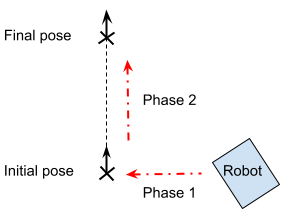

# Docking with robots that allow movements in x & y directions

## Usage

- Launch dalu_docking.launch
- Publish message of type geometry\_msgs/PoseStamped to topic /movel\_dalu\_docking/goal (for goal input) or call /movel\_dalu\_docking/run service with argument 'true' (for apriltag)
- Wait for message in /movel\_dalu\_docking/success to be published which indicates docking ended

Only use this if the goal is very close. It doesn't consider obstacles at all!

## Topics/Service

### tag_offset node

Subscribes to /tag_detections and publish transform between apriltag and dock position.

### dalu_docking node

* Published topics

/cmd\_vel\_mux/autonomous: To drive robot while docking

/movel\_dalu\_docking/success: To indicate docking success

* Subscribed topic

/movel\_dalu\_docking/goal: Start docking with goal input

* Service

/movel\_dalu\_docking/run: Start docking with apriltag (argument: true) or stop docking (argument: false)

## Parameters

### tag_offset node

* tag_id: ID number of apriltag
* apriltag\_x\_offset: Offset in x direction of dock position from apriltag
* apriltag\_y\_offset: Offset in y direction of dock position from apriltag

### dalu_docking node

* xy_tolerance: Distance tolerance from dock position
* yaw_tolerance: Yaw angle tolerance from dock position
* frames_tracked: Number of past dock positions taken to get average dock position
* max\_linear\_vel: Maximum linear speed while docking
* min\_linear\_vel: Minimum linear speed while docking
* max\_turn\_vel: Maximum turning speed while docking
* min\_turn\_vel: Minimum turning speed while docking

## Brief Explanation

Control happens in three stages:

1. Orient robot to match yaw of goal position
2. Move robot in y direction until within tolerance
3. Move robot in x direction until within tolerance

# Docking with differential drive robots

## Usage

- Launch diff_drive_docking.launch (dock in 2 phases) or diff_drive_docking.launch (dock in 1 phase) for apriltag docking.
- Launch diff_drive_docking_poseX.launch (where x=1,2,3) for pose input based docking (in 2 phases), each x value represent different offset distances between initial and final pose during docking set in the respective pose_offsetX.yaml files.
- Pose input is given through roslaunch arguments x, y, z and w, where x & y are position coordinates, and z & w are quaternion components representing yaw.
- Wait for message in /movel\_diff\_drive\_docking/success to be published which indicates docking ended.

Only use this if the goal is very close. It doesn't consider obstacles at all!

## Topics/Service

### tag_offset_plus node

* Subscribed topics

/tag\_detections: To get apriltag pose data

/movel\_tag\_offset/start: To refresh tracking of selected apriltag and track the nearest apriltag (to handle situations with multiple detected apriltags)

### pose_offset node

Publish transform between "map" frame and docking position based on pose input.

### diff_drive_docking node

* Published topics

/cmd\_vel\_mux/autonomous: To drive robot while docking

/movel\_diff\_drive\_docking/success: To indicate docking success

/movel\_diff\_drive\_docking/current\_goal: To show position of target pose for debugging purpose

* Subscribed topic

/odom: To get odometry data

* Service

/movel\_dalu\_docking/pause: To pause/resume docking

## Parameters

### tag_offset_plus node

* apriltag\_x\_offset: Offset in x direction of dock position from apriltag
* apriltag\_y\_offset: Offset in y direction of dock position from apriltag
* apriltag\_yaw\_tolerance: Maximum yaw deviation between robot and apriltag
* reverse: Whether to dock in reverse (true: reverse, false: forward)
* tag\_quantity: Number of tags used in a pose detection (1 if standalone, >1 if in a bundle)

### pose_offset node

* offset: Offset distance in meters between initial docking pose and final docking pose
* reverse: Whether to dock in reverse (true: reverse, false: forward)

### diff_drive_docking node

* init\_xy\_tolerance: Distance tolerance for initial docking position
* final\_xy\_tolerance: Distance tolerance for final docking position
* yaw\_tolerance: Yaw angle tolerance during docking
* final\_yaw\_tolerance: Yaw angle tolerance during yaw correction
* frames_tracked: Number of past dock positions taken to get average dock position
* max\_linear\_vel: Maximum linear speed while docking
* min\_linear\_vel: Minimum linear speed while docking
* max\_turn\_vel: Maximum turning speed while docking
* min\_turn\_vel: Minimum turning speed while docking
* max\_yaw\_diff: Maximum yaw difference between final yaw and robot yaw while docking
* reverse: Whether to dock in reverse (1: reverse, 0: forward)
* y\_bounds: Maximum y deviation at final docking position
* linear\_acc: Linear acceleration during docking
* final\_approach\_dist: Distance travelled in final stage docking with linear velocity only
* reference\_frame: Reference frame to process pose information with
* xy\_update\_tolerance: Minimum change in distance to update docking position
* yaw\_update\_tolerance: Minimum change in yaw to update docking position
* two\_phase: If true, carry out Phase 1 and 2 in Stage 1. If false, only carry out Phase 2 in Stage 1 (refer to 'Brief Explanation') 

## Brief Explanation

Control happens as follows:

* **Stage 1**: Dock towards target position. Consists of 2 phases:
  * Phase 1: Go to initial docking position
  * Phase 2: Go to final docking position

* **Stage 2**: Final stage docking with only linear velocity

In Stage 1, robot aproaches docking position by correcting yaw to face goal and move towards goal, then after reaching goal rotate in place to correct yaw.